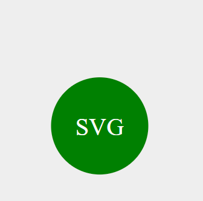

# logo-gen

## Logo Gen
log-gen is a SVG Logo Generator using Node.js application that allows you to create custom SVG logos with different shapes, text, and colors. This command-line tool provides an interactive way to generate SVG files based on your preferences.

Table of Contents
Getting Started
Prerequisites
Installation
Usage
Options
Examples
Contributing
License
Getting Started
Prerequisites
Before you can use the SVG Logo Generator, you'll need to have the following prerequisites installed on your system:

Node.js (v14 or higher)
npm (usually comes with Node.js)
## Installation
1.Clone the repository to your local machine:

git clone git@github.com:Punk1776/logo-gen.git

2.
cd logo-gen

3.Install the project dependencies by running the following command in your terminal: npm install --save-dev jest  npm install inquirer

## Usage
To generate an SVG logo, run the following command in your terminal:
node index.js

The application will prompt you for the following information:

Enter the text you want your logo to display (up to three characters).
Choose the text color (you can use color keywords or hexadecimal values).
Select the shape for your logo (Triangle, Square, or Circle).
Pick the background color for the chosen shape.
After providing these details, the application will generate an SVG logo named "logo.svg" based on your selections.

## Options
The SVG Logo Generator supports the following options:

None at the moment.
## Examples
Here are some examples of how to use the SVG Logo Generator:
Create a logo with the text "SVG," White text color, a circle shape, and a green background:

Follow the prompts and select your preferences.

## Contributing
Contributions to this project are welcome! If you have any ideas for improvements, bug fixes, or new features, please feel free to open an issue or submit a pull request. 

## License
This project is licensed under the MIT License - see the LICENSE file for details.

